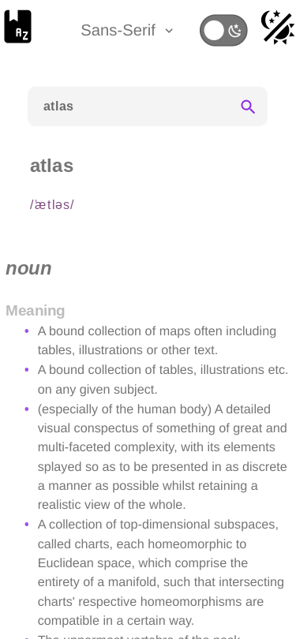

# Dictionary App

Inspired by this [video](https://www.youtube.com/watch?v=HfVwcMEkKwQ) and [frontend mentor challenge](https://www.frontendmentor.io/challenges/dictionary-web-app-h5wwnyuKFL).  

## Table of contents

- [Overview](#overview)
  - [Link](#link)
  - [Screenshots](#screenshots)
- [My process](#my-process)
  - [Built with](#built-with)
  - [Thoughts](#thoughts)
  - [Continued development](#continued-development)

## Overview

### Link

[Github Pages](https://jdegand.github.io/dictionary-app/)

### Screenshots

***

***

***

***

***

***

## My process

### Built with

- Semantic HTML5 markup
- CSS custom properties
- Flexbox
- CSS Grid
- Mobile-first workflow
- [React](https://reactjs.org/) - JS library
- [Vite](https://vitejs.dev/)
- [Vitest](https://vitest.dev/)
- [React Testing Library](https://testing-library.com/docs/react-testing-library/intro/)

## Thoughts

- Using context api for dark mode seems to rely upon using style tags to change the css. 
- You could use classes with ternaries based on a context theme value.  
- Context api best for low-frequency updates - because it causes all children to re-render. 
- Used svgs for icons - easier to change them for dark mode versus swapping multiple png icons.  
- design choice - let error take up whole section and remove previous word search results - leave previous search result and add error message    
- Adding a key to the audio tag is critical to having its src be updated
- Original toggle for dark mode was inaccessible with tab key.  Changed to an accessible toggle from this [blog article](https://kittygiraudel.com/2021/04/05/an-accessible-toggle).  
- pneumonoultramicroscopicsilicovolcanoconiosis - maxLength for search input 

## Continued development

- api request throttling - same request and debounce
- save dark mode preference to local storage & use local storage api to get value on load
- useAxiosFunction - refactor necessary for easier testing ? - returning an array versus an object - makes it clunky to invoke functions if you were to use renderHook - i.e. result.current[index] () - but hook shouldn't really be tested in isolation
- various tries at mocking useAxiosFunction error out and return a canceled error - not having access to the configObject is the problem 
- svg fill color changes remove from component and use class tied to a css variable for color - i.e. use currentcolor 

## Useful Resources

- [Material Design Icons](https://pictogrammers.com/library/mdi/icon/book-alphabet/) - book icon
- [LogRocket Blog](https://blog.logrocket.com/dark-mode-in-react-an-in-depth-guide/) - dark mode in-depth guide
- [YouTube](https://www.youtube.com/watch?v=Uz35Qiia84g) - dark mode
- [YouTube](https://www.youtube.com/watch?v=VzF2iTTc0MA) - dark mode with context api
- [YouTube](https://www.youtube.com/watch?v=N17qMDl4PyM) - dark mode with context api
- [Section](https://www.section.io/engineering-education/dark-mode-for-react-app-using-context-api-and-hooks/) - dark mode with context api and hooks
- [YouTube](https://www.youtube.com/watch?v=n_-ThmyQBdw) - dark mode context api
- [FreeCodeCamp](https://www.freecodecamp.org/news/separation-of-concerns-react-container-and-presentational-components/) - container and presentational components
- [Stack Overflow](https://stackoverflow.com/questions/43577182/react-js-audio-src-is-updating-on-setstate-but-the-audio-playing-doesnt-chang) - audio src issues
- [W3 Schools](https://www.w3schools.com/howto/howto_css_switch.asp) - css switch
- [Blog](https://betterprogramming.pub/the-superpowers-of-array-reduce-4b54085bedf) - reduce
- [Epic React](https://epicreact.dev/css-variables/) - css variables
- [Dev.to](https://dev.to/ziratsu/switch-to-a-darker-image-when-on-dark-mode-2lkh) - different image on dark mode
- [Stack Overflow](https://stackoverflow.com/questions/12836227/change-select-box-option-background-color) - select box option
- [CSS Tricks](https://css-tricks.com/making-pure-css-playpause-button/) - pure css play button
- [Blog](https://blog.shahednasser.com/how-to-style-an-audio-element/) - how to style an audio element
- [CodeSandbox](https://codesandbox.io/s/5wwj02qy7k) - Custom audio player with React hooks
- [Stack Overflow](https://stackoverflow.com/questions/55919714/my-implementation-of-debounce-axios-request-left-the-promise-in-pending-state-fo) - debounce
- [YouTube](https://www.youtube.com/watch?v=PySFIsgXNZ0) - Create a Search Bar With React and Debounce Input
- [Stack Overflow](https://stackoverflow.com/questions/13810085/html5-audio-display-only-play-pause-and-mute-buttons) - audio display only play pause and mute buttons
- [Stack Overflow](https://stackoverflow.com/questions/47686345/playing-sound-in-react-js) - playing sound in react
- [YouTube](https://www.youtube.com/watch?v=5ccdo8iWR58) - vite github pages
- [Dev.to](https://dev.to/shashannkbawa/deploying-vite-app-to-github-pages-3ane) - vite github pages
- [YouTube](https://www.youtube.com/watch?v=NqdqnfzOQFE) - Use Axios with React Hooks for Async-Await Requests
- [YouTube](https://www.youtube.com/watch?v=N41B_SVdzwg) - Use Axios with React Hooks for Async-Await Requests updated
- [Blog](https://travis.media/how-to-easily-style-a-select-dropdown/) - style a select dropdown
- [Blog](https://kittygiraudel.com/2021/04/05/an-accessible-toggle) - an accessible toggle
- [CSS Tricks](https://css-tricks.com/cascading-svg-fill-color/) - svg fill color
- [Eternal Dev](https://eternaldev.com/blog/testing-a-react-application-with-vitest/) - vitest with react
- [Dev.to](https://dev.to/mbarzeev/from-jest-to-vitest-migration-and-benchmark-23pl) - from jest to vitest
- [Stack Overflow](https://stackoverflow.com/questions/69591847/how-do-i-mock-audio-api-in-jest-properly) - mock audio api
- [YouTube](https://www.youtube.com/watch?v=0CJtoenFrkc) - How to test axios get request? | Test ReactJs Components.
- [Blog](https://medium.com/@doppelmutzi/testing-of-a-custom-react-hook-for-fetching-data-with-axios-26f012948a8f) - testing custom react hook
- [Code Sandbox](https://codesandbox.io/s/testing-custom-hook-demo-7uqwv?file=/src/useFetch.test.js) - useFetch.test.js
- [Stack Overflow](https://stackoverflow.com/questions/4908378/javascript-array-of-functions) - js array of functions
- [Blog](https://mistryakshar54.medium.com/lets-get-down-to-some-testing-hooks-axios-react-testing-library-4416e7958d89) - testing axios hooks
- [Stack Overflow](https://stackoverflow.com/questions/45016033/how-do-i-test-axios-in-jest) - test axios in jest
- [Run that line](https://runthatline.com/how-to-mock-axios-with-vitest/) - mock axios with vitest
- [Stack Overflow](https://stackoverflow.com/questions/45006254/how-to-change-the-behaviour-of-a-mocked-import/45007792#45007792) - how to change the behaviour of a mocked import
